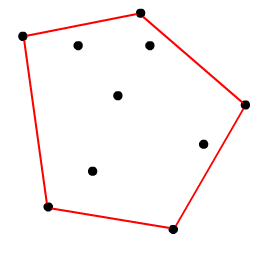
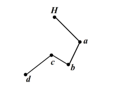

## [<<目录](../README.md)
## 凸包算法

### 凸包的概念
在二维欧几里得空间中，凸包可想象为一条刚好包着所有点的橡皮圈。用不严谨的话来讲，给定二维平面上的点集，凸包就是将最外层的点连接起来构成的凸多边型，它能包含点集中所有的点。如下图红色部分：



### 算法描述
输入：一个数组，存储平面上的一系列点
输出：一个数组，存储最外围的一系列点

### 算法实现

#### 1. 暴力求解

思路：取任意两点组成向量，判断其他点是否都在向量的一边，若是则这两个点在凸包上，否则不在，依次遍历完所有的向量，即可取得凸包上的所有点；

#### 2. Graham's Scan法求凸包

这个算法是由数学大师葛立恒（Graham）发明的，算法思路如下：
1) 找出所有点中y坐标最小的点，若y坐标最小的点有两个以上，则选择其中x坐标最小的点，将此点记为H；

2) 设除H之外所有点的坐标集合为N{p1,p2,p3,p4,p5,p6,…}，分别计算向量< H,p1>，< H,p2>，< H,p3>极坐标的角度，对集合N按极坐标角度的大小排序，即以H为圆心，顺时针扫描各点，将扫描到的点依次加入集合中；如下图，排好序的坐标集合为N{a1，a2，a3，a4，a5，a6}，其中θ为向量< H,a1>极坐标的角度。

3) 线段< H,a1>一定在凸包上，现在加入a2，假设a2也在凸包上，接下来加入a3，如果a3在向量<a1，a2>的左侧则判断a2不在凸包上，需将a2从凸包中移除，在此例中a3在向量<a1，a2>的右侧；然后加入a4，如果a4在向量<a2，a3>的左侧则判断a3不在凸包上，此例中a4在向量<a2，a3>的左侧，所以需将a3从凸包中移除，接下来需回溯判断a4在向量<a1，a2>的左侧还是右侧，决定是否要将a2移除…，即每加入一点时，必须考虑到前面的线段是否在凸包上。从基点开始，凸包上每条相临的线段的旋转方向应该一致，并与扫描方向相同。如果发现新加的点使得新线段与上线段的旋转方向发生变化，则可判定上一点必然不在凸包上。如下图：



当加入d点时，发现<c,d>和<b,c>的旋转方向不一致(d在<b,c>左侧)，则说明c点不在凸包上。
可用叉积来判断一个点在一个向量的左侧还是右侧，如上图，若<b,c>与<c,d>的叉积为正则d在<b,c>的右侧，若为负则在<b,c>的右侧，若为0，在d在<b,c>直线上。

*复杂度*

这个算法可以直接在原数据上进行运算，因此空间复杂度为O⑴。但如果将凸包的结果存储到另一数组中，则可能在代码级别进行优化。由于在扫描凸包前要进行排序，因此时间复杂度至少为快速排序的O(nlgn)。后面的扫描过程复杂度为O(n)，因此整个算法的复杂度为O(nlgn)。

### 葛立恒扫描法的javaSctipt代码

设数组points是存储所选图形的所有顶点的集合
```javascript
var convexPoints=[];//用来存储凸包
var startPoint=getStartPoint(points);//得到y坐标最小的点
points.splice(points.indexOf(startPoint),1);
points.sort(compare);//按极坐标排序
convexPoints.push(startPoint);
convexPoints.push(points[0]);
    
for(i=1;i<points.length;i++){
   var vector1={ x:convexPoints[convexPoints.length-1].x-convexPoints[convexPoints.length-2].x,
                 y:convexPoints[convexPoints.length-1].y-convexPoints[convexPoints.length-2].y};
                        
   var vector2={ x:points[i].x-convexPoints[convexPoints.length-1].x,
                 y:points[i].y-convexPoints[convexPoints.length-1].y};
    //若两个向量叉积小于0，则需将上一个点移除  
   while(getCross(vector1,vector2)<0){
        convexPoints.pop();
        vector1={ x:convexPoints[convexPoints.length-1].x-convexPoints[convexPoints.length-2].x,
                  y:convexPoints[convexPoints.length-1].y-convexPoints[convexPoints.length-2].y};
        vector2={ x:points[i].x-convexPoints[convexPoints.length-1].x,
                  y:points[i].y-convexPoints[convexPoints.length-1].y};
   }
   convexPoints.push(points[i]);
}
```
 
 求points集合中y坐标最小的点，y坐标相同的情况下，取x坐标最小的点
 
 ```javascript
 //选出y轴最小的点startPoint
function getStartPoint(points){
    var startPoint=points[0];
    for(var i=1;i<points.length;i++){
        if(points[i].y<startPoint.y){
            startPoint=points[i];
        }else if(points[i].y==startPoint.y){
            if(points[i].x<startPoint.x){
                startPoint=points[i];
            }
        }
    }
    return startPoint
}
 ```
  按极坐标角度排序的compare函数
  ```javascript
  //各点按极坐标的角度排序
function compare(value1,value2){
    var value1Angle=getPolarAngle(startPoint,value1);
    var value2Angle=getPolarAngle(startPoint,value2);
    if(value1Angle<value2Angle){
        return -1;
    }else if (value1Angle>value2Angle){
        return 1;
    }else{
        return 0;
    }
}
  ```