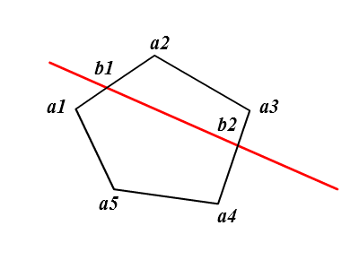

## [<<目录](../README.md)
## 切割凸多边形

用一条线段切割凸多边形，返回分开的两个多变形；<br>



### 多边形数据结构
用一系列顶点来描述多边形,比如上图的多边形可以用下面的一维数组来表示：
```
polygon=[a1,a2,a3,a4,a5];
```

### 算法描述

* 输入：

1.多边形polygon
2.线段line

* 输出：

一个数组，包含切割后的两个多边形:polygon1和polygon2;

### 思路

1.通过依次计算线段和每条边的交点，从而求得到线段和多边形的两个交点b1和b2，将交点插入多边形数组相应的位置，得到一个新的数组：
```
[a1,b1,a2,a3,b2,a4,a5]
```
2. b1,b2将多边形数组分为了3节，其中b1,b2和处于b1和b2之间的顶点组成一个多边形，b1，b2和其他的顶点组成另一个多边形，即:
```
polygon1=[b1,a2,a3,b2];
polygon2=[a1,b1,b2,a4,a5];
```

### 实现
```javascript

function cutPolygon(line,polygon){
	var polygoncopy=polygon.concat();
	var crosses=[];
	//求线段和多边形的交点
	for(var i=0,len=polygoncopy.length;i<len;i++){
		var nextIndex=i==(len-1)?0:(i+1);
		var side=[polygoncopy[i],polygoncopy[nextIndex]];
		var cross=segmentsIntr(side[0],side[1],line.startPoint,line.endPoint);
		if(cross){
			//记录交点的位置
			cross.index=i;
			crosses.push(cross);
		}
	}
	//若交点个数小于2说明没有切割多边形，返回null
	if(crosses.length<2){
		return null;
	}
	
	//根据交点的位置，依次把顶点放入不同的多边形数组中
	var polygon1=[],polygon2=[];
	for(var i=0,len=polygoncopy.length;i<len;i++){
		if(i==crosses[0].index){
			polygon1.push(polygoncopy[i]);
			polygon1.push(crosses[0],crosses[1]);
			polygon2.push(crosses[1],crosses[0]);
		}else if(i<crosses[0].index||i>crosses[1].index){
			polygon1.push(polygoncopy[i]);
		}else{
			polygon2.push(polygoncopy[i]);
		}
	}
	return [polygon1,polygon2];
}

```

